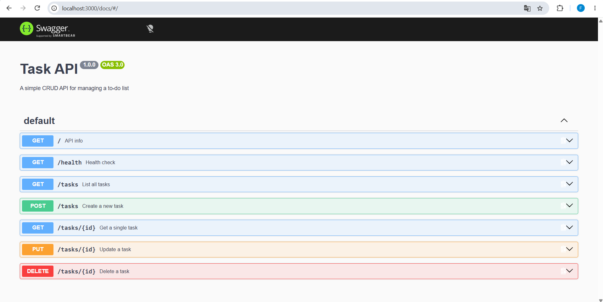

# Task API

A simple in-memory CRUD API for managing a to-do list. Built as Week 2 
assignment for FlyRank Internship, Backend Track. No database yet — 
data resets when the server restarts.

**Tech stack:** Node.js + Express

## How to run

\`\`\`bash
git clone https://github.com/Fadhil04/api-todoList.git
cd api-todoList
npm install
node index.js
\`\`\`

Server runs at `http://localhost:3000`.

## Endpoints

| Method | Path         | Description              |
|--------|--------------|---------------------------|
| GET    | /            | API info                 |
| GET    | /health      | Health check              |
| GET    | /tasks       | List all tasks            |
| POST   | /tasks       | Create a new task         |
| GET    | /tasks/:id   | Get a single task         |
| PUT    | /tasks/:id   | Update a task              |
| DELETE | /tasks/:id   | Delete a task              |

## Example request

\`\`\`
$ curl -i -X POST http://localhost:3000/tasks -H "Content-Type: application/json" -d '{"title":"Buy milk"}'

HTTP/1.1 201 Created
Content-Type: application/json; charset=utf-8

{"id":4,"title":"Buy milk","done":false}
\`\`\`

## Swagger UI

Interactive docs available at `http://localhost:3000/docs`

